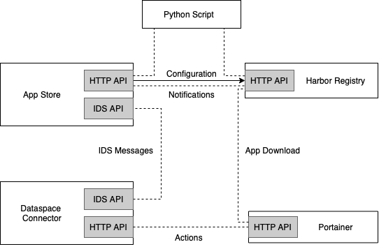

# Deployment
{: .fs-9 }

**This section is currently being edited.** In the future, this section will include guidance on deploying the IDS App Store. 
{: .fs-6 .fw-300 }

---

There are four main components needed to make the entire App Store environment running, starting from uploading an app to the App Store to downloading an app from the Connector.  

Those main components are as follows: 
* **Harbor Registry**: For uploading and downloading app images using Docker protocol 
* **App Store**: Managing metadata about Data Apps
* **Connector**: Search/Download app metadata from App Store, download/run/configure app containers
* **Portainer**: Management of Docker containers on client side (connector)

The connections between the above components are shown in the following figure:



It follows instructions on how to install each component.

## Installation  and Running of the Harbor Registry
It is advisable to have the registry install on a machine which have a domain name, not on localhost. Here the core instructions to install the Harbor Registry is given, using `sudo`. The full tutorial can be found under the following link: <https://goharbor.io/docs/2.4.0/install-config/>

1. **Download**: 
Download the latest Harbor release from the following website: <https://github.com/goharbor/harbor/releases> (currently version 2.4.1)

2. **Extract**: 
Extract the downloaded file: `sudo tar xvf harbor-offline-installer-version.tgz`. 
If there is an old installation, remove the old harbor data folders: `rm -r /data/database rm -r /data/registry` 

3. **[Configure HTTPS Access to Harbor](https://goharbor.io/docs/2.4.0/install-config/configure-https/)**

4. **Configure the Harbor yml file**: 
Edit `harbor.yml.tmpl` and rename it to `harbor.yml`. The parameters take effect when you run the `install.sh` script to install or reconfigure Harbor.

5. **Run the installer script**:
Run the following commands:
```
sudo ./prepare 
sudo ./install.sh
```

## Installation and Running of the App Store
The App Store can be installed from the following GitHub repository: <https://github.com/International-Data-Spaces-Association/IDS-AppStore>

It follows instructions on how to install and run the App Store:

Ensure that at least **Java 11** is installed. To build and run the IDS App Store locally, follow these steps:

1. Clone this repository: `git clone https://github.com/International-Data-Spaces-Association/IDS-AppStore.git`
2. Create /data/search folder on the root with `cd /` and `mkdir -p /data/search`. If required, change the directory in src/main/resources/application.properties: `spring.jpa.properties.hibernate.search.backend.directory.root = /data/search`.
3. Execute `cd IDS-AppStore`, `chmod +x mvnw` and `./mvnw clean package -DskipTests -Dmaven.javadoc.skip=true`.
4. Navigate to `/target` and run `java -jar appstore-{VERSION}.jar`.

If everything worked fine, the application is available at <https://localhost:8080/>. The API can be accessed at <https://localhost:8080/api>. The Swagger UI can be found at <https://localhost:8080/api/docs>.

For certain endpoints, you will be asked to log in. The default credentials are `admin` and `password`. Please take care to change these when deploying and hosting the App Store yourself.

As a specialization of the Dataspace Connector, the App Store must be configured in the same way as the Connector. This means, the IDS certificate must be configured for the App Store in the same way as for the Dataspace Connector. 
The configuration of the IDS certificate is explained [here](https://international-data-spaces-association.github.io/DataspaceConnector/Deployment/Configuration).

## Installation and Running of the Connector and Portainer: 

Instructions on how to install the Dataspace Connector can be found at the following link: <https://github.com/International-Data-Spaces-Association/DataspaceConnector>.

If both the Connector and the App Store are installed on the same machine, the running port must be changed in the `src/main/resources/application.properties` file. 8080 must be replaced with the number you choose, e.g., 8085.   

Portainer can be installed via the following link: <https://docs.portainer.io/v/ce-2.6/start/install/server/docker>.
The Connector is configured to connect to Portainer on port 9000.


